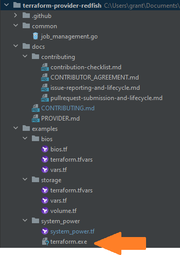

# Terraform provider for Redfish
The Terraform provider for Redfish is a plugin for Terraform that allows for full lifecycle management of x86 servers using Redfish REST APIs. For more details on Redfish, please refer to DMTF Redfish specification [here][redfish-website].

For general information about Terraform, visit the [official website][tf-website] and the [GitHub project page][tf-github].

[redfish-website]: https://www.dmtf.org/standards/redfish
[tf-website]: https://terraform.io
[tf-github]: https://github.com/hashicorp/terraform

## Requirements
-	[Terraform](https://www.terraform.io/downloads.html) 0.12.x
-	[Go](https://golang.org/doc/install) 1.13.x (to build the provider plugin)

## Installation

*Note*: This project uses [Go modules](https://blog.golang.org/using-go-modules) making it safe to work with it outside of your existing [GOPATH](http://golang.org/doc/code.html#GOPATH).  The instructions that follow assume a directory in your home directory outside of the standard GOPATH (i.e `$HOME/development/terraform-providers/`).

### Linux

Clone repository to: `$HOME/development/terraform-providers/`
```sh
$ mkdir -p $HOME/development/terraform-providers/; cd $HOME/development/terraform-providers/
$ git clone https://github.com/dell/terraform-provider-redfish.git
...
```

Enter the provider directory and run `go build`. This will build the provider and put the provider in the `$GOPATH/bin` directory.
```sh
$ go build
...
$ $GOPATH/bin/terraform-provider-redfish
...
```

### Windows

Download the Terraform binary from [Terraform's website](https://www.terraform.io/downloads.html). For Windows it is a standalone binary. If you already have an existing Terraform configuration, you can put it in the same directory is that configuration. If you just want to run one of our examples, place it in the appropriate examples folder. For example:



Navigate to your top level directory (terraform-provider-redfish) and run:

For more information on Terraform's new directory structure for local providers see [these patch notes](https://www.terraform.io/upgrade-guides/0-13.html#new-filesystem-layout-for-local-copies-of-providers).

```powershell
mkdir %appdata%\terraform.d\plugins\registry.terraform.io\dell\redfish\1.0\windows_amd64
go mod vendor
go build -o terraform-provider-redfish.exe
move .\terraform-provider-redfish.exe %appdata%\terraform.d\plugins\registry.terraform.io\dell\redfish\1.0\windows_amd64
```

Now change directories to the folder where you placed `terraform.exe` and run `terraform init`.

You should see an output like this:

    Terraform has been successfully initialized!

    You may now begin working with Terraform. Try running "terraform plan" to see
    any changes that are required for your infrastructure. All Terraform commands
    should now work.

    If you ever set or change modules or backend configuration for Terraform,
    rerun this command to reinitialize your working directory. If you forget, other
    commands will detect it and remind you to do so if necessary.

If you see something like (your version numbers will probably be different):

    Initializing modules...

    Initializing the backend...

    Initializing provider plugins...
    - Finding hashicorp.com/edu/hashicups versions matching "0.2.0"...

    Error: Failed to query available provider packages

    Could not retrieve the list of available versions for provider
    hashicorp.com/edu/hashicups: no available releases match the given constraints
    0.2.0

this means that your directory structure has issues. Go back and make sure your local directory structure matches exactly. For troubleshooting it might be helpful to add the `-plugins-dir` option to your `terraform init` command.


## Documentation
The documentation for the provider can found [here](https://github.com/dell/terraform-provider-redfish/blob/master/docs/PROVIDER.md)

## Roadmap
Our roadmap for Terraform provider for Redfish resources can be found [here](ROADMAP.md)

## Support
The code is provided AS-IS and not supported by Dell EMC.

## Contributing
The Terrafrom Redfish provider is open-source and community supported. We appreciate your help!
To contribute, please read the [contribution guidelines](docs/CONTRIBUTING.md). You may also [report an issue](https://github.com/dell/terraform-provider-redfish/issues/new/choose). Once you've filed an issue, it will follow the [issue lifecycle](docs/ISSUES.md).
