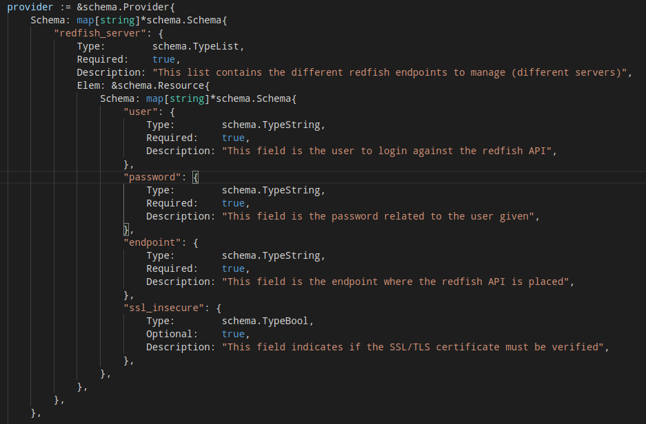
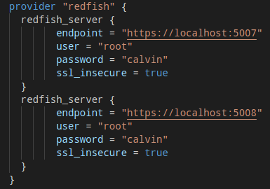
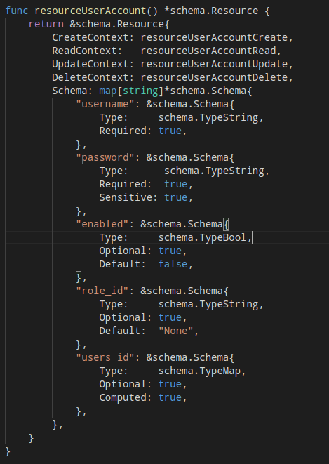
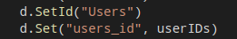

# Information about Redfish Terraform Provider
This guide will explain different parts of the provider and will give an overview about how the provider is built, to onboard quicker developers that might be interested in this project.  

## 1. Provider's way of operation
When you think of Terraform, normally users tend to think that the way a provider connects with a cloud provider is via a single endpoint. Well actually that's the way it works. Cloud providers provider and endpoint and users point to that endpoint when configuring terraform.  
~~~
  +-----------------+
  | Cloud provider  |
  +-------+---------+
          ^
          |
          |
+---------+----------+
| Terraform provider |
+--------------------+
~~~

With the Redfish Terraform Provider, that operating model have been changed because of the way the provider interacts with the infrastructure (Redfish endpoints).  
In a regular scenario (for instance a datacenter), operators don't just have one endpoint, but a bunch of them. Each redfish endpoint corresponds to each physical server.  
~~~
+------------------+     +------------------+      ...N        +------------------+
| PowerEdge Server |     | PowerEdge Server |  +-----------+   | PowerEdge Server |
| with Redfish API |     | with Redfish API |                  | with Redfish API |
+-------+----------+     +--------+---------+                  +---------+--------+
        ^                         ^                   ^                  ^
        |                         |                   |                  |
        +-------------------------+----------+--------+------------------+
                                             |
                                             |
                                  +----------+---------+
                                  | Terraform Provider |
                                  +--------------------+

~~~

This comes with some challenges when it comes to develop a terraform provider, because Terraform hasn't been thought for that. There were two ways this provider could have been implemented:
  - Create different alias for each redfish endpoint in the .tf files.
  - **Create a provider that supports different redfish endpoints and apply the defined resources to all of them**.
The chosen approach was the second one, as .tf files are less verbose and practically the provider will be much useful. *This doesn't mean that users cannot use aliases for different kind of servers.*

## 2. Provider declaration
The provider schema is the following:  
  
As it can be seen, the entry *redfish_server* has been set to a *schema.TypeList*. This gives the provider the ability of accepting different *redfish_server* blocks in the .tf file.  
Inside each *redfish_server* block, users will define the *user*, *password*, *endpoint* and *ssl_insecure* values. This means that within the same provider, different servers can be provisioned.  
  
In terms of the .tf file, this could be an example:  
  
As shown in the figure, the provider block *redfish* contains two *redfish_server* blocks inside it. This means that two servers will be managed using that provider instance. From now on, all resources specified for this provider will be applied to **all** redfish endpoints defined within it.

## 3. How the provider is implemented
### 3.1 Client generation
Essentially, from the provider schema a slice with client information will be generated. If the provider has been spawn with three *redfish_server* block, this slice will end up with a length of three. Each element will be an struct where the redfish endpoint string will be hold, along with the actual client used for communicating with the redfish API. To see how it is currently implemented, please check [redfish/config.go](../redfish/config.go).  

### 3.2 How IDs are kept for resources
Normally, in a terraform provider, the ID of a resource will be kept using the *schema.ResourceData.SetId()* method. For this particular case, and since several IDs need to be kept, a computed value needs to be used in each resource's schema:  
  
**/!\ - Check out the users_id value**  
This means that the computed value will be the one actually keeping the IDs. This value will consist of a map, where the key is the **redfish endpoint** from each server and the value the **actual ID**.  
Then, if IDs are kept in that computed value... What should be done with the ID that terraform actually recognices? Well, to solve that issue a dummy ID is set. Check the image below:  
  
*"Users"* will be the ID that terraform recognices (that actually tells us nothing, just a dummy value), and the computed value will keep a map (in the example that map in go is on the variable *usersIDs*) with the different endpoints and its IDs.

### 3.3 How CRUD operations are carried out on resources
Here it comes the interesting part. When calling whatever function that implement the different CRUD opperations, the function receives an slice with all clients. Then the function needs to loop through them and on each iteration needs to perform some GET/POST/DELETE calls. Just imagine that every iteration takes two seconds due to the fact that each HTTP call takes that time... If the number of server to manage is twenty... That call will take fourty seconds. Also depending on how many servers the provider is handling, the execution time might vary much.  
  
**To avoid that**, what the provider does is to go through the slice that keeps the redfish clients, and it **starts a go-routing for each client**. That means that each go-routing will handle each client, and execution times decrease dramatically (and they will be consistent either operators are managing two or twenty servers).  
  
Now, having clear that for each client a new go-routing is created, let's focus on the communication between each of the go-routines and the main one.  
Before start creating go-routines, a communication channel needs to be created. For this provider implementation, a buffered channel is created. The length of the buffered channel is set to the number of *redfish_server* block that we are handling, which eventually will be the number of clients we handle.  
  
For that buffered channel, two structs are used.
  - For CREATE/UPDATE/DELETE functions, a buffered channel with the struct *common.ResourceResult* is created.
  - For READ function, a buffered channel with the struct *common.ResourceChanged* is created.
To check the insigts of each struct, please refer to the documentation [there](../common/communication.go).
  
Having that buffered channel created, the function start creating the different go-routines and also passes the channel, along with the redfish client. The main go-routine at this point is creating all the different go-routines.  
When this finishes, it waits for reponses on the channel. When they start arriving the provider start doing whatever needs to do, according to the function being executed (CREATE, UPDATE, DELETE, READ).   

### 3.4 Execution flow
~~~
                                       +----------------+
    +---------------+                  |go-routines that|
    |Main go|routine|                  |handle clients  |
    +---------------+                  +----------------+
+-------------------------------------------------------------+
    +----------------+
    |Creates buffered|
    |channel         |
    +-------+--------+
            |
            v
    For as many clients
    as are set:
            +
            |                           +-----------------+
            +-------------------------->+ Main go-routine |
            |    Passes client and      | create new      |
            |    channel                +--------+--------+
            |                                    |
            |                                    |
            |                                    v
            |                           +--------+----------+
            |                           |Performs any of the|
            |                           |CRUD operations    |
            |                           +--------+----------+
            v                                    |
    +-------+---------------+                    |
    |Waits for go-routines  |                    |
    |to write on the channel+<-------------------+
    +-------+---------------+         Writes on the channel
            |                         result of the operation
            |
            |
            v
   +------------------------+
   |Do whatever needs to do |
   |depending on which CRUD |
   |function is being       |
   |executed                |
   +------------------------+
~~~

### 3.5 How CREATE/UPDATE/DELETE function work
TBD
### 3.6 How READ function work
TBD
