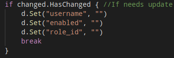

# Information about Redfish Terraform Provider
This guide will explain different parts of the provider and will give an overview about how the provider is built, to onboard quicker developers that might be interested in this project.  

## 1. Provider's way of operation
When you think of Terraform, normally users tend to think that the way a provider connects with a cloud provider is via a single endpoint. Well actually that's the way it works. Cloud providers provider and endpoint and users point to that endpoint when configuring terraform.  
~~~
  +-----------------+
  | Cloud provider  |
  +-------+---------+
          ^
          |
          |
+---------+----------+
| Terraform provider |
+--------------------+
~~~

With the Redfish Terraform Provider, that operating model have been changed because of the way the provider interacts with the infrastructure (Redfish endpoints).  
In a regular scenario (for instance a datacenter), operators don't just have one endpoint, but a bunch of them. Each redfish endpoint corresponds to each physical server.  
~~~
+------------------+     +------------------+      ...N        +------------------+
| PowerEdge Server |     | PowerEdge Server |  +-----------+   | PowerEdge Server |
| with Redfish API |     | with Redfish API |                  | with Redfish API |
+-------+----------+     +--------+---------+                  +---------+--------+
        ^                         ^                   ^                  ^
        |                         |                   |                  |
        +-------------------------+----------+--------+------------------+
                                             |
                                             |
                                  +----------+---------+
                                  | Terraform Provider |
                                  +--------------------+

~~~

This comes with some challenges when it comes to develop a terraform provider, because Terraform hasn't been thought for that. There were two ways this provider could have been implemented:
  - Create different alias for each redfish endpoint in the .tf files.
  - **Create a provider that supports different redfish endpoints and apply the defined resources to all of them**.
The chosen approach was the second one, as .tf files are less verbose and practically the provider will be much useful. *This doesn't mean that users cannot use aliases for different kind of servers.*

## 2. Provider declaration
The provider schema is the following:  
  
As it can be seen, the entry *redfish_server* has been set to a *schema.TypeList*. This gives the provider the ability of accepting different *redfish_server* blocks in the .tf file.  
Inside each *redfish_server* block, users will define the *user*, *password*, *endpoint* and *ssl_insecure* values. This means that within the same provider, different servers can be provisioned.  
  
In terms of the .tf file, this could be an example:  
  
As shown in the figure, the provider block *redfish* contains two *redfish_server* blocks inside it. This means that two servers will be managed using that provider instance. From now on, all resources specified for this provider will be applied to **all** redfish endpoints defined within it.

## 3. How the provider is implemented
### 3.1 Client generation
Essentially, from the provider schema a slice with client information will be generated. If the provider has been spawn with three *redfish_server* block, this slice will end up with a length of three. Each element will be an struct where the redfish endpoint string will be hold, along with the actual client used for communicating with the redfish API. To see how it is currently implemented, please check [redfish/config.go](../redfish/config.go).  

### 3.2 How IDs are kept for resources
Normally, in a terraform provider, the ID of a resource will be kept using the *schema.ResourceData.SetId()* method. For this particular case, and since several IDs need to be kept, a computed value needs to be used in each resource's schema:  
  
**/!\ - Check out the users_id value**  
This means that the computed value will be the one actually keeping the IDs. This value will consist of a map, where the key is the **redfish endpoint** from each server and the value the **actual ID**.  
Then, if IDs are kept in that computed value... What should be done with the ID that terraform actually recognices? Well, to solve that issue a dummy ID is set. Check the image below:  
  
*"Users"* will be the ID that terraform recognices (that actually tells us nothing, just a dummy value), and the computed value will keep a map (in the example that map in go is on the variable *usersIDs*) with the different endpoints and its IDs.

### 3.3 How CRUD operations are carried out on resources
Here it comes the interesting part. When calling whatever function that implement the different CRUD opperations, the function receives an slice with all clients. Then the function needs to loop through them and on each iteration needs to perform some GET/POST/DELETE calls. Just imagine that every iteration takes two seconds due to the fact that each HTTP call takes that time... If the number of server to manage is twenty... That call will take fourty seconds. Also depending on how many servers the provider is handling, the execution time might vary much.  
  
**To avoid that**, what the provider does is to go through the slice that keeps the redfish clients, and it **starts a go-routing for each client**. That means that each go-routing will handle each client, and execution times decrease dramatically (and they will be consistent either operators are managing two or twenty servers).  
  
Now, having clear that for each client a new go-routing is created, let's focus on the communication between each of the go-routines and the main one.  
Before start creating go-routines, a communication channel needs to be created. For this provider implementation, a buffered channel is created. The length of the buffered channel is set to the number of *redfish_server* block that we are handling, which eventually will be the number of clients we handle.  
  
For that buffered channel, two structs are used.
  - For CREATE/UPDATE/DELETE functions, a buffered channel with the struct *common.ResourceResult* is created.
  - For READ function, a buffered channel with the struct *common.ResourceChanged* is created.  
To check the insigts of each struct, please refer to the documentation [there](../common/communication.go).
  
Having that buffered channel created, the function start creating the different go-routines and also passes the channel, along with the redfish client. The main go-routine at this point is creating all the different go-routines.  
When this finishes, it waits for reponses on the channel. When they start arriving the provider start doing whatever needs to do, according to the function being executed (CREATE, UPDATE, DELETE, READ).   

### 3.4 Execution flow
~~~
                                       +----------------+
    +---------------+                  |go-routines that|
    |Main go|routine|                  |handle clients  |
    +---------------+                  +----------------+
+-------------------------------------------------------------+
    +----------------+
    |Creates buffered|
    |channel         |
    +-------+--------+
            |
            v
    For as many clients
    as are set:
            +
      +-----+-----+  Passes client and  +-----------------+
      |Creates    |  channel            |  New go-routine |
      |go-routines+-------------------->+                 |
      +-----+-----+                     +--------+--------+
            |                                    |
            |                                    |
            |                                    v
            |                           +--------+----------+
            |                           |Performs any of the|
            |                           |CRUD operations    |
            |                           +--------+----------+
            v                                    |
    +-------+---------------+                    |
    |Waits for go-routines  |                    |
    |to write on the channel+<-------------------+
    +-------+---------------+         Writes on the channel
            |                         result of the operation
            |
            |
            v
   +------------------------+
   |Do whatever needs to do |
   |depending on which CRUD |
   |function is being       |
   |executed                |
   +------------------------+
~~~

### 3.5 How CREATE/UPDATE/DELETE function work
These three functions have in common that all use a buffered channel made with the struct *common.ResourceResult*.
This section explains how this channel is used, and how the developer should handle these three functions.
#### **Create**
When it comes to create, the main go-routine will wait for feedback listening on the buffered channel previously created. The different go-routines created, should write on the channel the result of the execution using a *common.ResourceResult* struct. If it was ok, the *ID* field must be set to the resource ID. Otherwise the *Error* field must be set to *true* and the *ErrorMsg* field to the actual error that happened. *Endpoint* must be set on both scenarios, to the actual ID if success or empty if failed.  
Then, the main go-routine will start reading from the buffered channel as many times as the go-routines created. It will start adding the new IDs to the map that keeps track of the resources (that later on will be set to the computed value used for keeping that). If there was any error, error messages will be added to a variable.  
After getting all feedback from go-routines, the computed value that holds the actual IDs as well as the dummy ID will be set to keep track of what happened. After that the error messages variable will be checked. If this last one has not been set, the function will return success, if it was, it will return error using the error messages variable set before.   

#### **Update**
For updating, the go-routines will get their ID from the computed value, and will check if the values corresponding to that ID on the actual infrastructure corresponds to the ones set in the input variables from the *resource*.  
It will use the same principle as the create function. Main go-routine will wait for feedback by listening on the buffered (created with struct *common.ResourceResult*)channel. As soon as the client go-routines start writing on it, the main go-routine will set the map that holds the actual IDs that later on is written into the computed value. If there are error, the update fuction will return an error with the error message(s) set or if that variable is empty, it'll return a success. Before writing into the channel, the computed value is set to keep that of what's done so far.  

#### **Delete**
For the delete function, it works similarly to the CREATE and UPDATE function. A buffered channel is created (with struct *common.ResourceResult*) and passed to all client go-routines. If these ones writes the *endpoint* and an empty *ID*, means that the deletion was completed sucessfully.  
The main go-routine keeps reading from its channel and if an specific return from a client go-routine was sucessful, it removes that entry from the map that keeps track of IDs. If it wasn't successful, it gather the error and **do not remove that entry from the map that keeps track of the IDs**.  
When finished reading from the channel, if everything was sucessful, it unsets the computed value that keeps all IDs as well as the dummy ID, to let terraform know that all resources have been destroyed. If there was some error, the map that keeps track of IDs is set (this is done to keep track of what is still there since it wasn't able to be deleted) and the dummy ID is not removed.  

### 3.6 How READ function work
The read function will use a buffered channel made with the struct *common.ResourceChanged*.  
This function differs a little from the rest of them. First of all, it uses a different struct when creating the buffered channel. The only difference between both structs is that, the one used here, gets rid of the *ID* and includes a boolean field called **HasChanged**.  
That field will be used from the client go-routine to notify the main go-routine that something has changed. If the data provided in the .tf file doesn't correspond with the one deployed in the actual infrastructure, the client go-routine will set this field to true.  
When the main go-routine starts reading from the buffered channel, as soon as it founds out that **just one of the resources doesn't compy with what is stated in the .tf file** it triggers an update.  
Since modifying computed values in the READ function doesn't count when checking if an update should be trigger, what it's done here is to set all user input values to empty (*""*), so that the read values and the ones in the .tf file are different. This little trick makes Terraform to trigger an update. Check out the figure below:  
  
  
### 3.7 Important notice about errors on CREATE/UPDATE/DELETE/READ functions
It is important to note that for setting ErrorMsg, within each go-routine, the **endpoint** must be provider prior the error message. This is done like this because when the error is prompted to the user, this one knows exactly which was the one that failed.  
It is much easier to troubleshoot with an error like this:  
~~~
[https://my-idrac-001.corporate.lan] Error when retrieving account list
[https://my-idrac-007.corporate.lan] There was an issue with the APIClient
~~~  
  
Than having something generic like this (just imagine managing twenty servers):  
~~~
Error when retrieving account list
There was an issue with the APIClient
~~~  
  
### 3.8 Important notice about state of each resource
This provider keeps track of the IDs of each and every resource by using a computed value map. That map only keeps the *redfish endpoint* as **key** and the *ID* of the resource as **value**.  
There might be people that argue that the last state of every endpoint should be kept. Since this provider only cares about the final state from those, that information is worthless. For instance, just having an ID, an UPDATE function can check if the values configured as input by the user in the resource match what is actually there. If they differ, the function will update them. If not, it will do nothing.  
For instance, if a READ function detects that there is a drift in one of the servers because someone has change that without using Terraform, Terraform will prompt a message saying an update is needed, and only that server will be modified.  
If a READ fuction detects that there was a change on the .tf file, it will trigger an update that will affect the whole infrastructure.  
  
